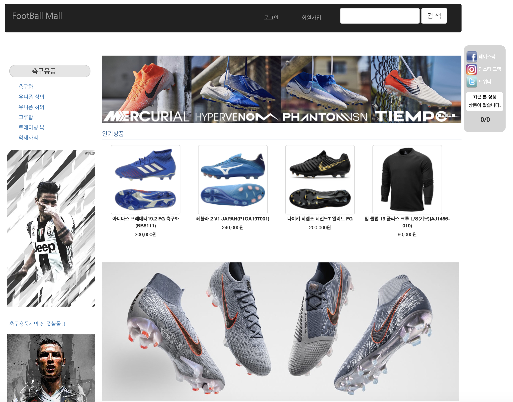
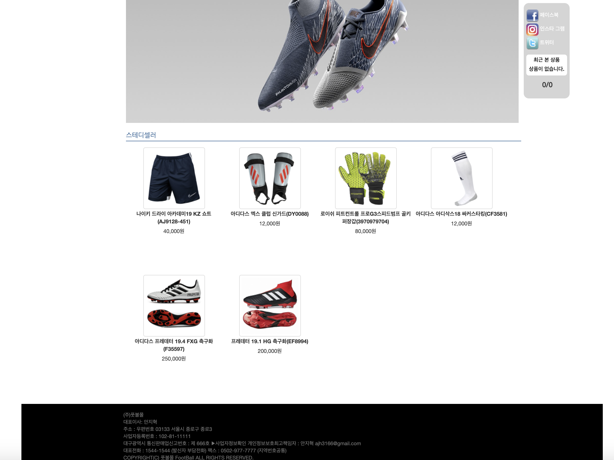
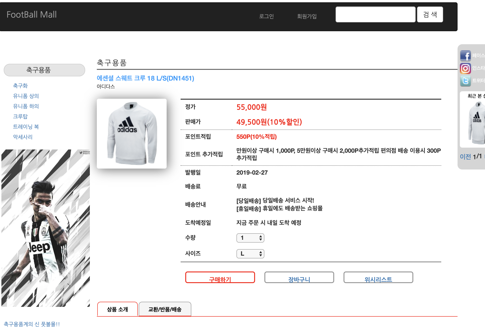
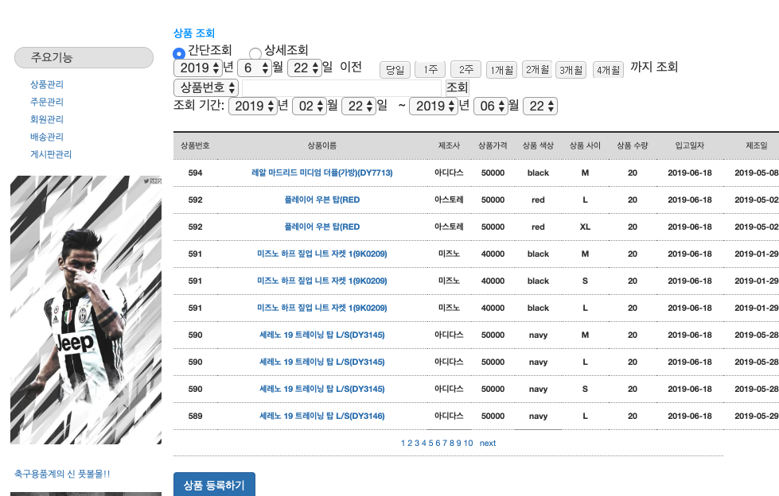
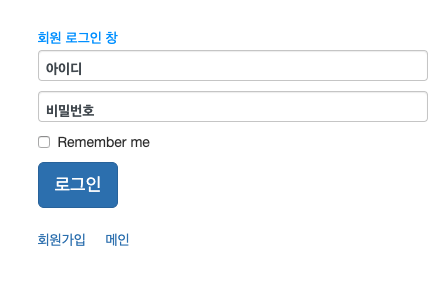
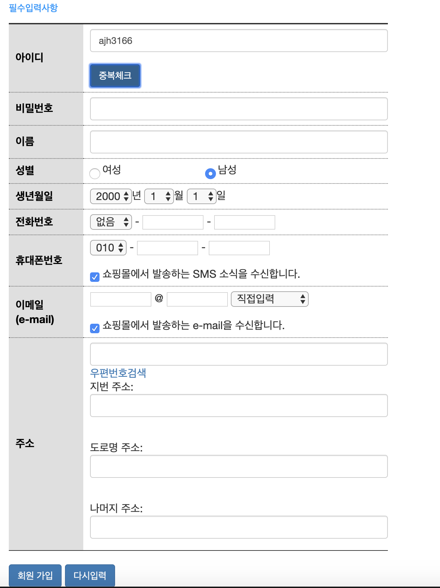

# SpringFootballMall

<h1> 스프링 MVC 쇼핑몰</h1>
<ul>
  <li><h3>작업기간 : (21일) </h3></li>
  <li><h3>작업인원 : 단독작업</h3></li>
  <li><h3>작업 툴 : STS(Eclipse), Apache Tomcat-9.0.16, Oracle, sqldeveloper, Docker, GitHub</h3></li>
  <li><h3>부트 스트랩 : <a href="https://startbootstrap.com/template-categories/all/">Startbootstrap</a>사용</h3></li>
  <li><h3>작품소개 : Spring MVC 패턴의 관리자 모드가 있는 쇼핑몰 프로젝트</h3></li>
  <li><h3>상세 설명 : <a href="https://github.com/zidol/SpringMybatisBoard/blob/master/SpringBoardProject.pdf">SpringBoardProject.pdf</a></h3></li>
</ul>
<h4>메인 화면 1</h4>
  
  <h4>메인 화면 2</h4>
  
  <h4>상품 상세</h4>
  
  <h4>관리자 화면</h4>
  
  <h4>로그인</h4>
  
  <h4>회원가입</h4>
  